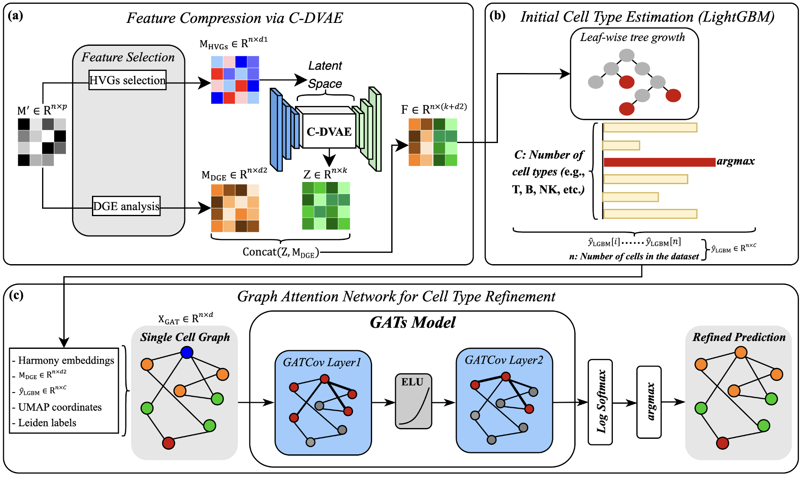

# scLightGAT: A LightGBM-based Framework Integrating C-DVAE and GATs for Robust Single-cell RNA-seq Cell Type Annotation

## Data
📁 [**Data (Google Drive)**](https://drive.google.com/drive/folders/1CDj-lMrybfSmMprmgd2GFIARXL0J1ynZ?usp=sharing)

All processed single-cell training and testing datasets (in `.h5ad` format) used for reproducing scLightGAT results can be downloaded from the link above.  
Please ensure sufficient storage before downloading large files.

---


## Overview
We propose **scLightGAT**, a Python-native, biologically informed, and computationally scalable framework for cell-type annotation. scLightGAT combines machine learning and deep learning techniques through a three-stage architecture:
1. **C-DVAE**: Contrastive Denoising Variational Autoencoder extracts low-dimensional latent features from highly variable genes (HVGs).
2. **LightGBM**: A gradient-boosted classifier uses the fused latent (Z) and DGE marker (M_DGE) features for an initial cell-type prediction.
3. **GATs**: Graph Attention Networks refine LightGBM’s output by modeling neighborhood interactions on a single-cell graph (SCG).

Designed for high-quality, well-preprocessed datasets, scLightGAT achieves accurate annotations across both immune and non-immune compartments and demonstrates particular strength in resolving complex subtypes like cancer-associated fibroblasts (CAFs). Benchmarking across five public Gene Expression Omnibus (GEO) datasets confirms its ability to balance annotation accuracy, runtime efficiency, and subtype resolution—making it a practical tool for large-scale scRNA-seq studies.

---

## Installation

```bash
git clone https://github.com/your-username/scLightGAT.git
cd scLightGAT
pip install -r requirements.txt
pip install -e .
```

---


## Pipeline Overview


<div align="center">
  
  <br/>
  <small>Figure: Overview of the scLightGAT framework. </small>
  <small>(a) C-DVAE compresses HVGs and DGE markers into a fused feature matrix.</small>  
  <small>(b) LightGBM performs initial cell-type estimation.</small>  
  <small>(c) A two-layer GAT refines predictions on the single-cell graph (SCG).</small>
</div>


---

## Quick Start

### 🏋️ Training

```python
import sys, importlib
import scLightGAT.pipeline

# Reload to pick up any local changes
importlib.reload(scLightGAT.pipeline)

# Simulate command-line arguments for training
sys.argv = [
    "pipeline.py",
    "--mode", "train",
    "--train", "/home/dslab_cth/scLightGAT/data/train.h5ad",
    "--test", "/home/dslab_cth/scLightGAT/data/GSE153935.h5ad",
    "--output", "/home/dslab_cth/scLightGAT/results",
    "--model_dir", "/home/dslab_cth/scLightGAT/scLightGAT/models",
    "--train_dvae",
    "--use_gat",
    "--dvae_epochs", "5",
    "--gat_epochs", "300"
]

from scLightGAT.pipeline import main
main()
```

- `--mode train`
- `--train <path/to/train.h5ad>`
- `--test  <path/to/test.h5ad>`
- `--output <results_dir>`
- `--model_dir <model_save_dir>`
- `--train_dvae` (flag to train C-DVAE)
- `--use_gat` (flag to enable GAT refinement)
- `--dvae_epochs <int>` (number of C-DVAE epochs)
- `--gat_epochs <int>` (number of GAT epochs)

After training, the results folder will contain:
- Trained C-DVAE encoder/decoder weights
- LightGBM model & logits
- GAT model weights & refined predictions
- UMAP plots and confusion matrices (if enabled)

---

## Authors

**Tsung-Hsien Chuang**, **Cheng-Yu Li**, **Liang-Chuan Lai**, **Tzu-Pin Lu**, **Mong-Hsun Tsai**, **Eric Y. Chuang***, and **Hsiang-Han Chen***
- Tsung-Hsien Chuang, Liang-Chuan Lai, Tzu-Pin Lu, Mong-Hsun Tsai, Eric Y. Chuang are with the National Taiwan University, Taipei, Taiwan.
- Cheng-Yu Li and Hsiang-Han Chen are with the National Taiwan Normal University, Taipei, Taiwan.
- *Correspondence to: Hsiang-Han Chen (chenh2@ntnu.edu.tw) and Eric Y. Chuang (chuangey@ntu.edu.tw).

---

## Acknowledgments

This work was supported in part by the National Science and Technology Council (Taiwan) under grant NSTC 113-2222-E-003-001.

---

© 2025 Tsung-Hsien Chuang, Cheng-Yu Li, Liang-Chuan Lai, Tzu-Pin Lu, Mong-Hsun Tsai, Eric Y. Chuang, and Hsiang-Han Chen. All rights reserved.
